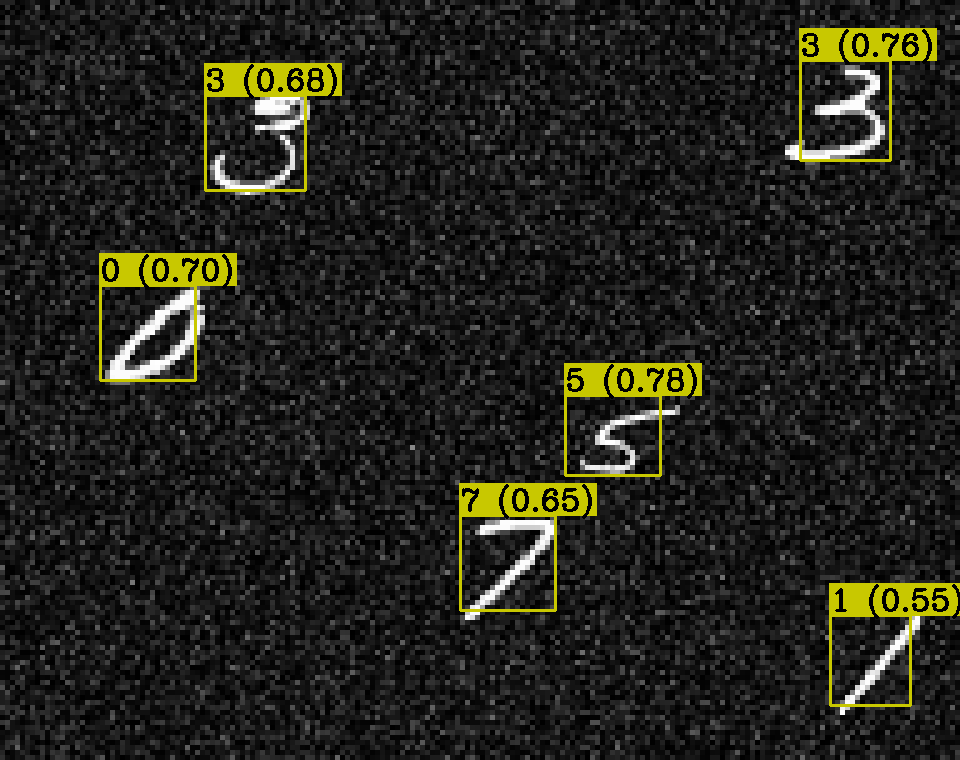

# Formation Yolo
Implementation de [YOLOv2](https://arxiv.org/abs/1612.08242) from scratch sur torch (une version précédente sur [TF2 est également disponible](https://github.com/Youlixx/yolo_v2_tf2)).

Les slides de la formation sont dispos pour les formules utilisées; deux notebook sont dispos:
- yolo.ipynb : un notebook qui contient du code pour entrainer / tester le modèle, rien a completer.
- yolo_tp.ipynb : version "TP" du notebook ou il y a du code a remplir, une version complétée est également disponible.